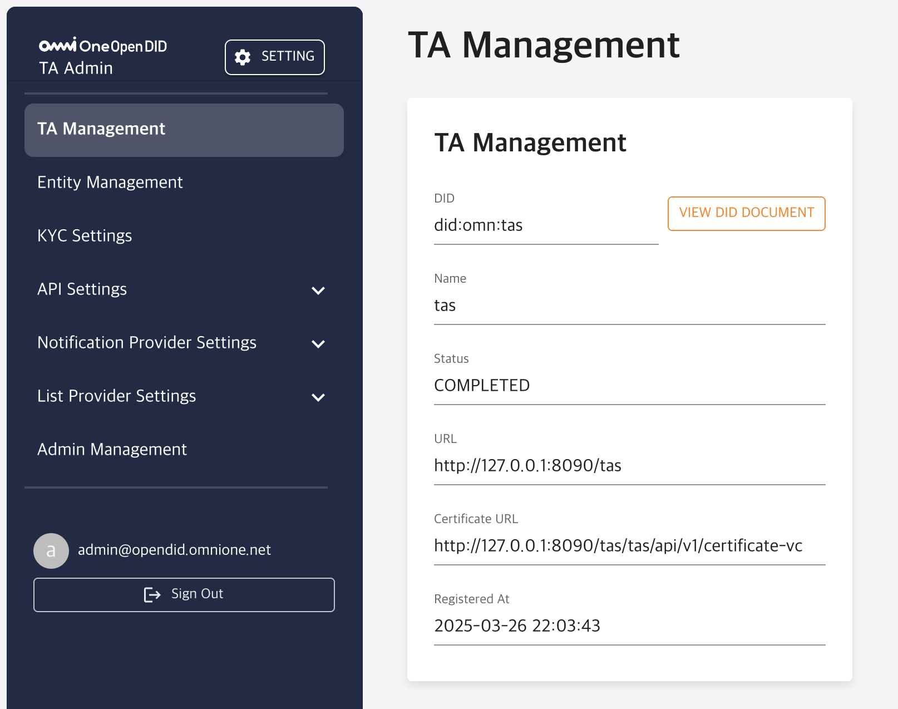
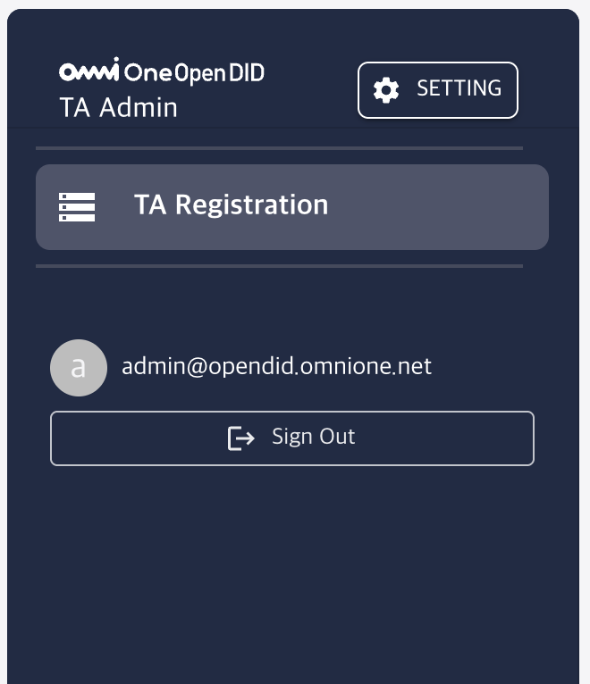
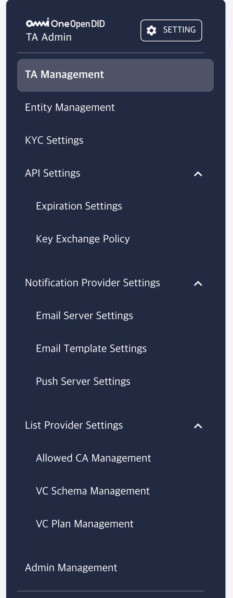
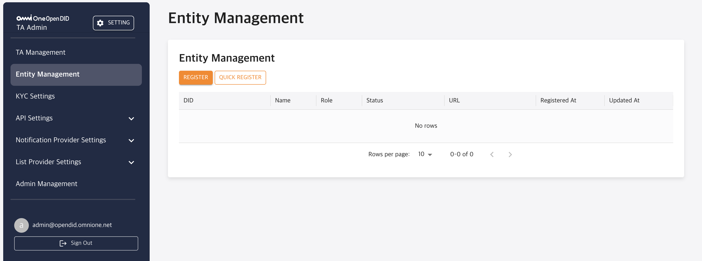

---
puppeteer:
    pdf:
        format: A4
        displayHeaderFooter: true
        landscape: false
        scale: 0.8
        margin:
            top: 1.2cm
            right: 1cm
            bottom: 1cm
            left: 1cm
    image:
        quality: 100
        fullPage: false
---

Open DID TA Admin Console Guide
==

- Date: 2025-03-31
- Version: v1.0.0

목차
==

- [Open DID TA Admin Console Guide](#open-did-ta-admin-console-guide)
- [목차](#목차)
- [1. 소개](#1-소개)
  - [1.1. 개요](#11-개요)
  - [1.2. Admin Console 정의](#12-admin-console-정의)
- [2. 기본 메뉴얼](#2-기본-메뉴얼)
  - [2.1. 로그인](#21-로그인)
  - [2.2. 메인 화면 구성](#22-메인-화면-구성)
  - [2.3. 메뉴 구성](#23-메뉴-구성)
    - [2.3.1. TA 미등록 상태](#231-ta-미등록-상태)
    - [2.3.2. TA 등록 상태](#232-ta-등록-상태)
  - [2.4. 비밀번호 변경 관리](#24-비밀번호-변경-관리)
- [3. 기능별 상세 메뉴얼](#3-기능별-상세-메뉴얼)
  - [3.1. TA Management](#31-ta-management)
    - [3.1.1. TA 등록](#311-ta-등록)
    - [3.1.2. 등록된 TA 관리](#312-등록된-ta-관리)
  - [3.2. Entity Management](#32-entity-management)
  - [3.2.1. Entity 목록 조회](#321-entity-목록-조회)
  - [3.2.2. Entity 등록](#322-entity-등록)
  - [3.2.3. Entity 상세](#323-entity-상세)
  - [3.2.4. Entity 수정](#324-entity-수정)
  - [3.2.5. Entity 삭제](#325-entity-삭제)
  - [3.2.6. Entity 상태 변경](#326-entity-상태-변경)

# 1. 소개

## 1.1. 개요

본 문서는 Open DID TA Admin Console의 설치 및 구동 방법을 안내합니다.  
기본 사용법부터 각 기능별 상세 메뉴얼까지 단계적으로 설명하여, 사용자가 콘솔을 효율적으로 활용할 수 있도록 구성되어 있습니다.

OpenDID의 전체 설치에 대한 가이드는 [Open DID Installation Guide]를 참고해 주세요.

<br/>

## 1.2. Admin Console 정의

TA Admin Console은 Open DID 시스템 내에서 TA 서버를 관리하기 위한 웹 기반의 관리자 도구입니다.  

현재 버전에서는 TA 서버가 단독 기능 외에도 Notification 사업자와 List 사업자의 역할도 함께 수행하고 있기 때문에,  
해당 사업자들에 대한 설정도 함께 관리할 수 있습니다.

TA Admin Console에서 설정할 수 있는 주요 항목은 다음과 같습니다:
- TA 사업자 설정
  - TA 서버 등록
  - Entity 서버 등록
  - 트랜잭션 유효 시간 및 키 교환 정책 설정
- Notification 사업자 설정
  - 이메일 서버 설정
  - Push 서버 설정
- List 사업자 설정
  - 허용된 CA 목록 설정

<br/>

# 2. 기본 메뉴얼

이 장에서는 Open DID TA Admin Console의 기본적인 사용 방법에 대해 안내합니다.

## 2.1. 로그인

Admin Console에 접속하려면 다음 단계를 따르세요:

1. 웹 브라우저를 열고 TA Admin Console URL에 접속합니다.

   ```
   http://<ta_domain>:<port>
   ```

2. 로그인 화면에서 관리자 계정의 이메일과 비밀번호를 입력합니다.
   - 기본 관리자 계정: <admin@opendid.omnione.net>
   - 초기 비밀번호: password (최초 로그인 시 변경 필요)

3. '로그인' 버튼을 클릭합니다.

> **참고**:  
> 보안상의 이유로 최초 로그인 시에는 비밀번호 변경이 필요합니다.

<br/>

## 2.2. 메인 화면 구성

로그인 후 표시되는 메인 화면은 다음과 같은 요소들로 구성되어 있습니다:



| 번호 | 영역             | 설명 |
|------|------------------|------|
| 1 | 헤더 영역 | 우측 상단의 `SETTING` 버튼을 통해 비밀번호 변경 화면으로 이동할 수 있습니다. |
| 2    | 콘텐츠 영역       | 현재 선택된 메뉴의 제목과 해당 콘텐츠가 표시됩니다. 각 메뉴에 따라 화면 내용이 바뀝니다. |
| 3    | 사이드바 메뉴     | 화면 왼쪽에 위치하며, 주요 메뉴 항목들이 세로로 정렬되어 있습니다. 선택한 메뉴는 강조 표시되며, 필요한 경우 하위 메뉴가 펼쳐집니다. |
| 4    | 사용자 정보 영역  | 현재 로그인한 관리자의 이메일 주소와 '로그아웃(Sign Out)' 버튼이 표시됩니다. |


<br/>

## 2.3. 메뉴 구성

TA Admin Console의 사이드바 메뉴는 **TA 등록 상태에 따라 화면 구성에 차이**가 있습니다.

<br/>

### 2.3.1. TA 미등록 상태

TA 서버가 아직 등록되지 않은 초기 상태에서는  
메뉴에 `TA Registration` 항목만 단독으로 표시됩니다.



### 2.3.2. TA 등록 상태

TA 등록이 완료되면 전체 관리 기능이 활성화되며, 사이드바 메뉴는 다음과 같이 구성됩니다:



| 번호 | 메뉴 명칭 | Depth | 설명 |
|------|-----------|--------|------|
| 1 | **TA Management** | 1 | TA 서버의 기본 정보(DID, URL 등)를 확인하고 관리하는 메뉴입니다. |
| 2 | **Entity Management** | 1 | Issuer, Verifier 등 Entity 서버들을 등록 및 관리하는 메뉴입니다. |
| 3 | **KYC Settings** | 1 | KYC 관련 설정을 관리하는 메뉴입니다. |
| 4 | **API Settings** | 1 | API 동작 정책을 설정하는 상위 메뉴입니다. |
| 5 | └ Expiration Settings | 2 | API 요청의 유효시간(만료 시간)을 설정할 수 있습니다. |
| 6 | └ Key Exchange Policy | 2 | 키 교환에 대한 정책을 설정할 수 있습니다. |
| 7 | **Notification Provider Settings** | 1 | 알림 제공자(Notification Provider)를 설정하는 상위 메뉴입니다. |
| 8 | └ Email Server Settings | 2 | 발신용 이메일 서버 정보를 설정하는 메뉴입니다. |
| 9 | └ Email Template Settings | 2 | 발송되는 이메일의 템플릿을 설정하는 메뉴입니다. |
| 10 | └ Push Server Settings | 2 | 푸시 알림 서버 정보를 설정하는 메뉴입니다. |
| 11 | **List Provider Settings** | 1 | 목록 제공자(List Provider)를 설정하는 상위 메뉴입니다. |
| 12 | └ Allowed CA Management | 2 | 허용된 CA(Certificate Authority) 목록을 설정하는 메뉴입니다. |
| 13 | └ VC Schema Management | 2 | VC 발급에 사용할 VC 스키마를 관리하는 메뉴입니다. |
| 14 | └ VC Plan Management | 2 | VC 발급 플랜을 설정하는 메뉴입니다. |
| 15 | **Admin Management** | 1 | 관리자의 계정 및 권한을 관리하는 메뉴입니다. |

> **참고**:  
> 위 메뉴 구성에 대한 각 기능의 상세 사용법은  
> [3장. 기능별 상세 메뉴얼](#3-기능별-상세-메뉴얼)에서 번호 순서에 따라 설명합니다.

<br/>

## 2.4. 비밀번호 변경 관리

사용자 비밀번호 변경은 다음 단계를 통해 수행할 수 있습니다:

1. 헤더 영역의 'SETTING' 버튼을 클릭합니다.
2. 설정 메뉴에서 '비밀번호 변경'을 선택합니다.
3. 비밀번호 변경 화면에서:
   - 현재 비밀번호 입력
   - 새 비밀번호 입력
   - 새 비밀번호 확인 입력
4. '저장' 버튼을 클릭하여 변경 사항을 적용합니다.

> **참고**: 비밀번호는 8자 이상, 64자 이하의 알파벳 대/소문자, 숫자, 특수문자를 포함해야 합니다.

<br/>

# 3. 기능별 상세 메뉴얼

이 장에서는 TA Admin Console의 주요 기능에 대한 상세 사용 방법을 안내합니다.


## 3.1. TA Management

TA Management는 TA 서버의 등록 및 상태 관리를 위한 기능입니다.  
TA 서버는 Open DID 시스템의 신뢰 체인 구축 및 운영을 담당하는 중심 구성 요소로,  
등록이 완료되어야 다른 Entity 서버들도 정상적으로 등록 및 동작할 수 있습니다.  

TA 등록은 최초 1회만 수행되며, 이후에는 관리 화면에서 등록된 상태를 확인할 수 있습니다.

<br/>

### 3.1.1. TA 등록

TA 서버가 아직 등록되지 않은 초기 상태에서는,  
TA Admin Console 좌측 메뉴에 `TA Registration` 항목만 표시됩니다.  

TA 등록을 위해 아래 절차를 따라 진행해 주세요:

1. 브라우저에서 Admin Console에 접속합니다.
   ```
   http://<ta_domain>:<port>
   ```

2. 로그인 후 표시되는 `TA Registration` 화면에서 아래 정보를 입력하고 등록을 진행합니다.
   - Server URL: `http://<ta_domain>:<port>/tas`
   - [QUICK REGISTER] 버튼 클릭
   > ⚠️ 현재는 임시 Quick Register 방식만 지원되며,  
   > 정식 등록 절차는 2025년 6월에 업데이트될 예정입니다.

3. 등록이 완료되면 메뉴가 확장되어 전체 기능을 사용할 수 있게 됩니다.

<br/>

### 3.1.2. 등록된 TA 관리

TA 등록이 완료되면 `TA Management` 메뉴가 활성화되며,  
등록된 TA의 DID 정보, 상태, URL 등을 확인할 수 있습니다.


| 번호 | 항목 | 설명 |
|------|------|------|
| 1 | DID | TA의 고유 식별자입니다. 형식은 'did:omn:tas'와 같은 형태로 표시됩니다. |
| 2 | Name | TA의 이름입니다. |
| 3 | Status | TA의 상태를 나타냅니다. 등록되었기 때문에 COMPLETED로 고정입니다.  |
| 4 | URL | TA 서버의 기본 URL 주소입니다. |
| 5 | Certificate URL | TA의 가입증명서를 확인할 수 있는 URL 주소입니다. |
| 6 | Registered At | TA가 Open DID에 등록된 날짜와 시간을 표시합니다. |
| 7 | VIEW DID DOCUMENT | DID Document를 확인할 수 있는 버튼입니다. 클릭 시 팝업 형태로 블록체인에 등록된 DID 문서 정보가 표시됩니다. |
| 8 | DID Document 내용 | VIEW DID DOCUMENT 버튼을 클릭했을 때 표시되는 DID Document의 내용입니다. JSON 형식으로 TA의 DID 정보, controller, 생성일시, 검증 방법 등이 포함됩니다. |


## 3.2. Entity Management

`Entity Management` 메뉴에서는 Issuer, Verifier, CA, Wallet 등  
Open DID 시스템에 참여하는 Entity 서버들을 등록하고 관리할 수 있습니다.

메뉴에 진입하면 등록된 Entity 목록을 테이블 형태로 확인할 수 있으며,  
신규 등록 또는 일괄 등록 기능을 통해 서버 정보를 추가할 수 있습니다.

<br/>



## 3.2.1. Entity 목록 조회

`Entity Management` 화면은 사이드 메뉴에서 **Entity Management** 항목을 클릭하여 접근할 수 있습니다.  
해당 화면에서는 Open DID 시스템에 등록된 Entity 서버의 목록을 테이블 형태로 확인할 수 있습니다.

| 항목          | 설명 |
| ------------- | ---- |
| **DID**           | Entity의 고유 DID 식별자입니다. |
| **Name**          | Entity의 이름입니다. |
| **Role**          | Entity의 역할을 나타냅니다. (예: Issuer, Verifier, CA, Wallet) |
| **Status**        | Entity의 등록 상태를 나타냅니다.<br/><br/>- `DID_DOCUMENT_REQUIRED`: DID Document가 아직 등록되지 않은 상태입니다.<br/>- `CERTIFICATE_VC_REQUIRED`: DID Document는 등록되었으나 가입 증명서 VC가 발급되지 않은 상태입니다.<br/>- `COMPLETED`: DID Document와 VC가 모두 등록 완료된 상태입니다. |
| **URL**           | Entity 서버의 기본 URL입니다. |
| **Registered At** | Entity가 Open DID에 등록된 일시입니다. |
| **Updated At**    | Entity 정보가 마지막으로 수정된 일시입니다. |

---

<br/>

`QUICK REGISTER` 기능은 테스트 편의성을 위한 임시 기능입니다.  
해당 버튼을 클릭하면 Orchestrator에서 설치된 모든 Entity 서버에 대해 다음 작업이 자동으로 수행됩니다:

- 각 Entity 서버의 DID Document 등록  
- VC(가입 증명서) 발급  
- 발급된 VC를 해당 서버에 전달

> ⚠️ 이 기능은 **개발/테스트 환경**에서만 사용해야 하며,  
> 운영 환경에서는 반드시 **수동 등록 절차**를 따라야 합니다.

## 3.2.2. Entity 등록

작성 필요

## 3.2.3. Entity 상세

작성 필요

## 3.2.4. Entity 수정

6월 중에 기능 제공 예정

## 3.2.5. Entity 삭제

6월 중에 기능 제공 예정

## 3.2.6. Entity 상태 변경

6월 중에 기능 제공 예정


[Open DID Installation Guide]: https://github.com/OmniOneID/did-release/blob/main/release-V1.0.0.0/OepnDID_Installation_Guide-V1.0.0.0.md


